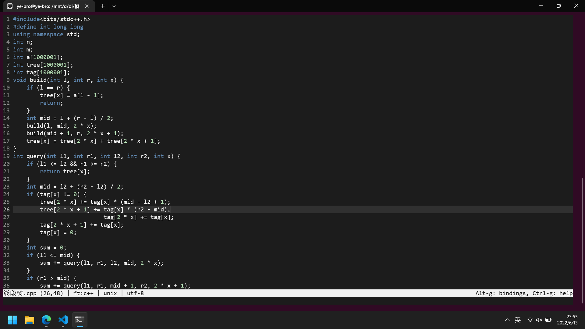
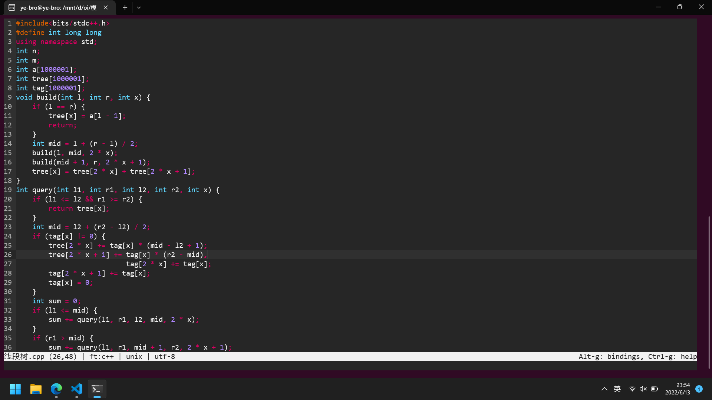

怎么用micro编辑器仿照vscode配色主题？我感觉默认的monokai太难看了，用惯了vscode默认主题的我想自定义一个vscode的micro主题

#### 前后对比图




#### 如何操作
首先，必须安装micro，这是显然的

然后编辑配置文件，是一个.micro文件，在哪里呢？在~/.config/micro里面，创建或者进入文件夹~/.config/micro/colorschemes，新建配置文件，不妨叫vscode.micro吧，因为主题是vscode

然后在文件中写入

```micro
color-link default "#ffffff,#1e1e1e"
color-link comment "#6a9955"
color-link constant "#ce9178"
color-link constant.number "#b5cea8"
color-link identifier "#ffffff"
color-link statement "#569cd6"
color-link type "#569cd6"
color-link constant.bool "#569cd6"
color-link symbol.tag "#569cd6"
color-link selection "#ffffff,#264f78"
color-link preproc "#569cd6"
color-link cursor-line "#333333"
color-link line-number "#858585"
color-link current-line-number "#c6c6c6"
```

最后打开micro，运行配置文件：按下ctrl+e，在命令输入框输入```set colorscheme vscode```就行了

同样也可以自己配置自己喜欢的颜色主题，只需运行```set colorscheme 配置文件名```就行

当然，这不是我自己摸索来的，我参阅了官方文档，你也可以访问[官方文档](https://github.com/zyedidia/micro/blob/master/runtime/help/colors.md)